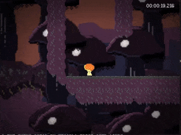

This is a puzzle precision platformer and my game jam entry for the [LÖVE jam 2024](https://itch.io/jam/love2d-jam-2024), where you play as a small shroom exploring a dense mushroom forest filled with musky smells and humid spells.



You can play my entry on itch.io [here](https://richardbaltrusch.itch.io/fungal-whimsy).

## How to run

To run, download lua and the love framework (LÖVE 11.4), then run love.exe in the current folder:

```
love .
```

Note: you may have to specify the full path to the love executable if it is not on your path.

## How to package

Build using the `tools\build.py` script or use the manual build method described below:

```
python tools\build.py
```

### Manual Love build

Detailed packaging instructions for Windows are documented [here](https://love2d.org/wiki/Game_Distribution).

Essentially, select all files required to run the game, zip them, rename .zip to .love, then concatenate it with love.exe and distribute it will all .dll's (including license) found in the love installation folder:

```batch
::zip game code and assets by hand to make FungalWhimsy.zip, then run:
copy FungalWhimsy.zip FungalWhimsy.love
copy /b love.exe+FungalWhimsy.love FungalWhimsy.exe
::finally, copy all love2d dlls into folder containing .exe (including license).
```

### Web build

An HTML build for the web can be built using [love.js](https://github.com/Davidobot/love.js):

```
npm install love.js
npx love.js.cmd FungalWhimsy.love webbuild -t="Fungal Whimsy" -c
```

Manually test the webbuild locally by running the following command, then opening `localhost:8000`:

```
python -m http.server --directory webbuild
```

## License

The code is available under the [MIT License](LICENSE). The artwork and audio is not included under this licensing and may only be used jointly with the code provided in this repository for non-commercial purposes. Redistribution of the artwork and audio requires permission of the author.
